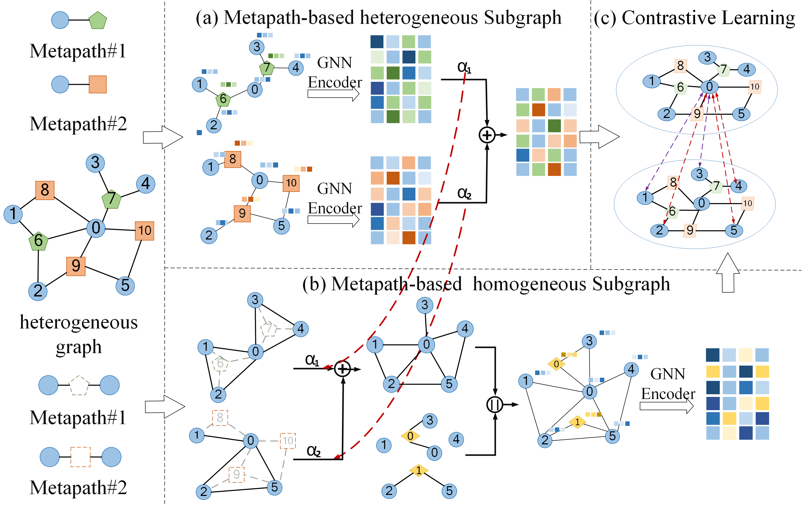

# Semi-Supervised Heterogeneous Graph Contrastive Learning with Label-Guided

##Authors: Chao Li1, Guoyi Sun1, Xin Li1 and Juan Shan2*

## Keywords: 
Heterogeneous Graph Neural Networks, Semi-Supervised Learning, Contrastive Learning, Label Information

## ntroduction:
Heterogeneous Graph Neural Networks represent a powerful approach 
to understand and utilize the intricate structures and semantics within
complex graphs. When it comes to semi-supervised learning on graphs,
the challenge lies in effectively leveraging labeled data to generalize
predictions to unlabeled nodes. Traditional methods often fall short
in fully utilizing labeled information, limiting their performance to
the number of available labels. To overcome these limitations, in this
paper, we propose a Semi-Supervised Heterogeneous Graph Contrastive
Learning with Label-Guided (SSGCL-LG) model. SSGCL-LG tackles
this challenge by fully integrating label information into the learn-
ing process through contrastive learning. Specifically, it constructs a
label graph that incorporates both node and label representations,
enhancing the supervised signal. Moreover, we propose a novel strat-
egy for selecting positive and negative samples based on labels and
meta-paths, effectively pulling positive samples closer together in the
embedding space. To optimize node representations, SSGCL-LG com-
bines contrastive loss with semi-supervised loss, enabling the model to
learn from both labeled and unlabeled data



## Environment Settings
> python==3.8.5 \
> scipy==1.5.4 \
> torch==1.7.0 \
> numpy==1.19.2 \
> scikit_learn==0.24.2

CPU: Intel(R) Xeon(R) Silver 4210 CPU @ 2.20GHz
## Usage
Fisrt, go into ./code, and then you can use the following commend to run our model: 
> python main.py IMDB --cpu:0

Here, "IMDB" can be replaced by "ACM", "DBLP".

## Cite
```
@inproceedings{SSGCL-LG,
  author    = {Chao li and
               Guoyi sun and
               Xin Li and
               Juan Shan},
  title     = {Semi-Supervised Heterogeneous Graph Contrastive Learning with Label-Guided},
  booktitle = {***},
  pages     = {***},
  year      = {***}
}
```
## Contact
If you have any questions, please feel free to contact me with 1139457124@qq.com
